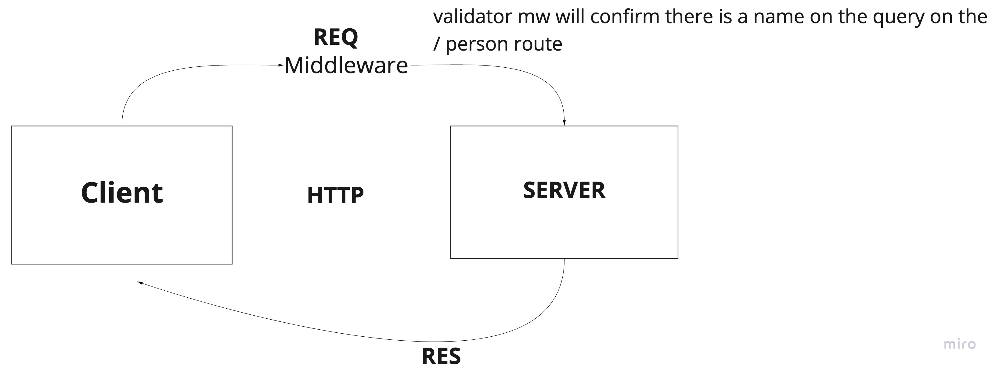

# Lab: Class 02

## Project: basic-express-server

### Author: Audrey Patterson

## Links and Resources

- [Main Branch deployed to heroku](https://audrey-basic-express-server.herokuapp.com/)
- [ci/cd](http://xyz.com)
- [Pull Request dev to main](http://xyz.com)

### Setup

#### `.env` requirements (when applicable)

#### How to initialize/run your application (where applicable)

- e.g. `npm start`

#### Tests

- How do you run tests?
- Any tests of note?
- Describe any tests that you did not complete, skipped, etc

#### UML / Application Wiring Diagram

